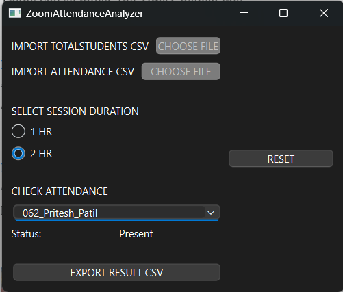

# Zoom Attendance Analyzer

A Qt-based desktop application to analyze Zoom meeting attendance using participant reports. It parses data, calculates individual attendance durations, and outputs comprehensive reports for single session.

## Features

- Load total students and Zoom attendance report (CSV)
- Set session duration to qualify attendance
- View individual student attendance 
- Export complete attendance report to CSV
- Clean, native UI using Qt Widgets
- Event handling via Qt’s signal and slot mechanism

## Build Instructions
### Requirements

- Qt 6.7.3 or Qt 6.x
- Qt Creator  
- C++ Compiler (GCC/Clang/MSVC)

### Steps

1. Clone the repository:
   git clone https://github.com/pritesh002/ZoomAttendanceAnalyzer.git
   cd ZoomAttendanceAnalyzer
2. Open ZoomAttendanceAnalyzer.pro in Qt Creator
3. Select the build kit
4. Click Build, then Run

## Usage

1. **Load** a CSV containing the full list of enrolled students.  
2. **Load** the Zoom-generated participant report.  
3. **Select** the session duration — attendance is validated based on cutoff time.
4. **Check** individual student attendance by selecting their name from the dropdown.  
5. **Export** the complete student-wise attendance report to a CSV file.

## Screenshots
